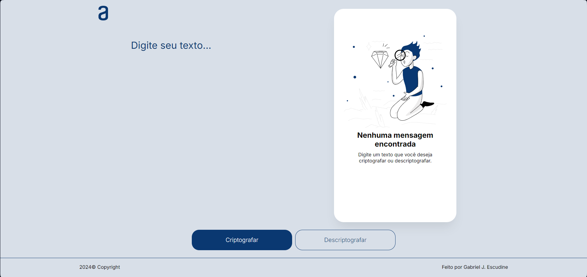

# 🔒 Encriptação e Decriptação de Mensagens

Este é um projeto simples de criptografia e descriptografia de mensagens. Ele permite ao usuário encriptar textos utilizando um algoritmo básico de criptografia e depois decriptá-los de volta ao seu formato original.

## 📚 Visão Geral
O projeto foi criado para fins educacionais, visando demonstrar como a criptografia básica funciona. Com uma interface simples, o usuário pode inserir uma mensagem, aplicar criptografia e, em seguida, descriptografá-la usando a chave correta.

## 🛠️ Tecnologias Utilizadas
<ul>
  <li>HTML5: Para a estrutura básica da interface;</li>
  <li>CSS3: Para o design e layout;</li>
  <li>JavaScript: Para a lógica de criptografia e descriptografia.</li>
</ul>

## 🔑 Funcionalidades
<ul>
  <li>Criptografar mensagens: Converte o texto inserido em uma forma criptografada;</li>
  <li>Descriptografar mensagens: Restaura o texto original a partir da mensagem criptografada.</li>
</ul>

## 🔒 Algoritmo de Criptografia
Este projeto usa um algoritmo simples de substituição de caracteres para criptografar e descriptografar mensagens. O usuário insere uma frase e ao clicar no botão de criptografia, a mensagem é encriptada. Também é possível decriptar essa mesma mensagem através do botão de decriptação.

## 📬 Contatos
Gostou do projeto? Gostaria de saber mais sobre mim? Entre em contato!

- 📧 Email: [gabrieljescudine.05@gmail.com](mailto:gabrieljescudine.05@gmail.com)
- 💼 LinkedIn: [Gabriel Joffily Escudine](https://www.linkedin.com/in/gabrieljoffilyescudine/)
